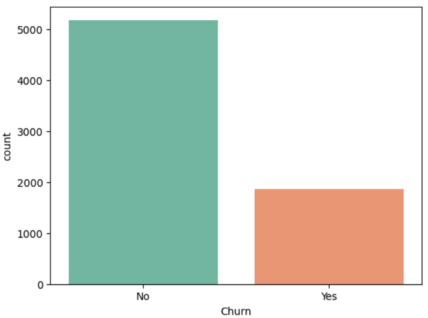
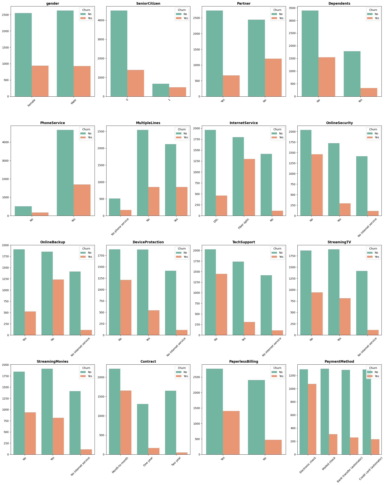
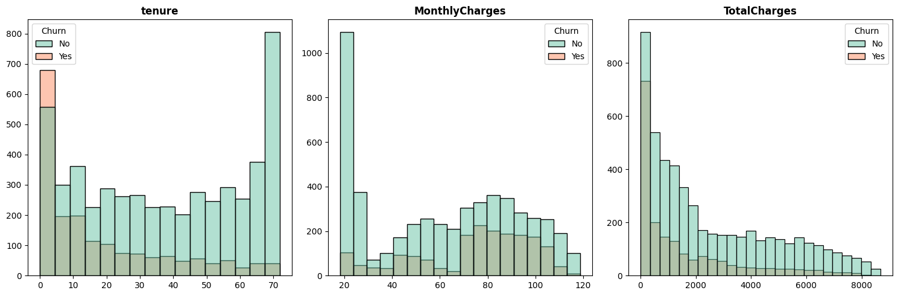
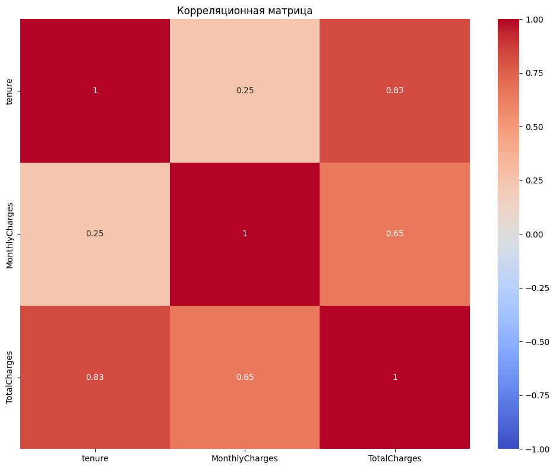
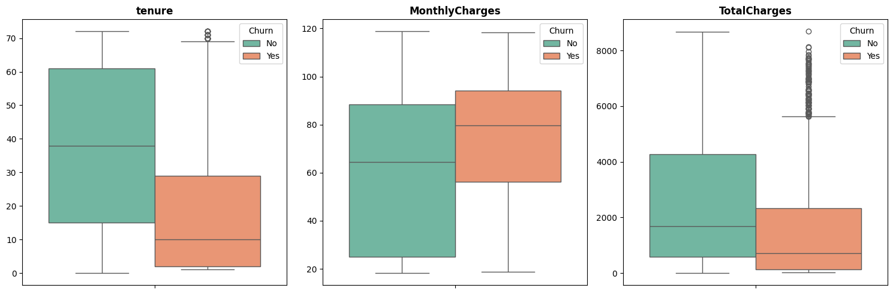
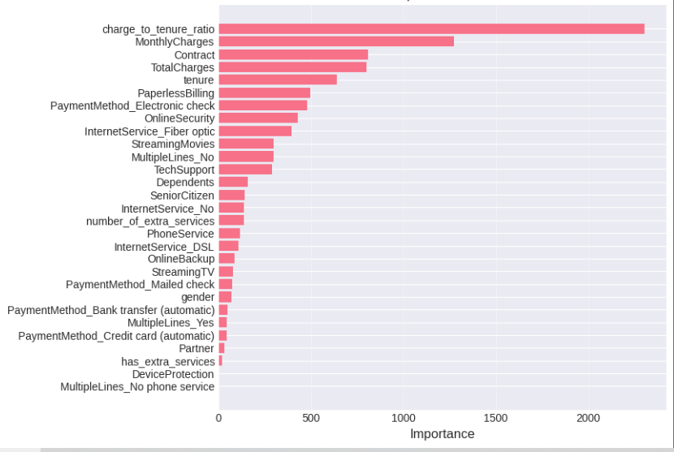
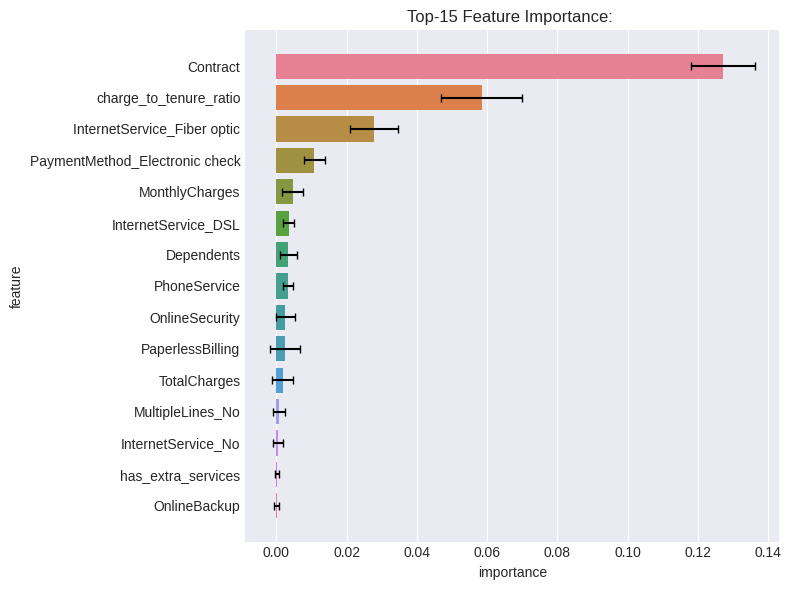
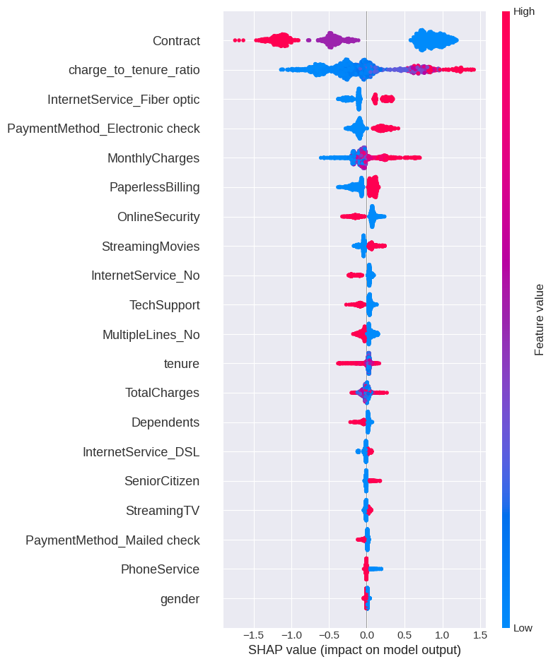
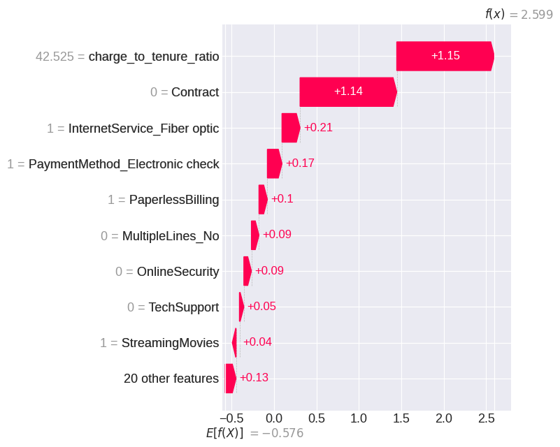
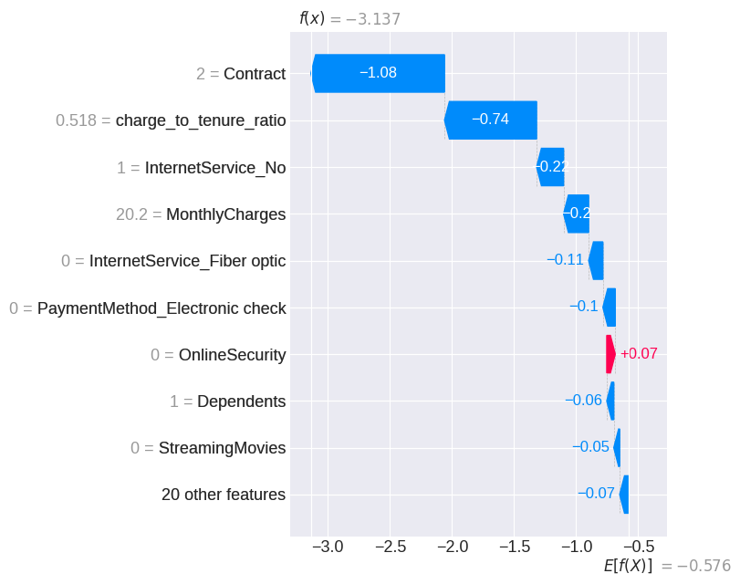

# Churn prediction

Прогнозирование оттока клиентов телеком-компании, сравнение методов 

## Цель проекта 
Целью проекта является построение модели для предсказания оттока клиентов телеком-компании, сравнение методов работы с дисбалансом классов и интерпретируемость итогового решения.

## Данные
- Источник: Kaggle [Telco Customer Churn](https://www.kaggle.com/datasets/blastchar/telco-customer-churn)

- 7043 клиента, 21 признак
- Целевая переменная: Churn

## EDA
1. Есть умеренный дисбаланс ~73% / 26% 

2. - Отсутствие дополнительных услуг (InternetService, OnlineSecurity, OnlineBackup, TechSupport) снижает отток клиентов
   - Пользователи с типом оплаты Electronic check уходят чаще
   - Тип контракта month-to-month повышает риск ухода клиента

3. Новые пользователи с нулевым сроком обслуживания (tenure) и без платежей больше склонны уходить

4. Есть высокая корреляция между tenure и TotalCharges (0.8), а так же между MonthlyCharges и TotalCharges (0.65) (Возможно будет влиять на линейные модели, для древесных - не кретично)

5. У TotalCharges есть выбросы, но они  являются логичными, так как они соответствуют клиентам с большим сроком обслуживания

## Предобработка
- Данные были разделены на Train/Val/Test - 70/15/15
- Добавлены 3 новых признаков:
  - has_extra_services - наличие доп услуг
  - number_of_extra_services - количество доп услуг
  - charge_to_tenure_ratio - среднемесячный платеж за все время обслуживания
- PaymentMethod, InternetService, MultipleLines были закодированы с помощью OHE

## Модели 
1. Бэйзлайн(DummyClassifier - стратегия stratified): ~ F1: 25 , ROC_AUC: 0.49
2. Проведено сравнение 5 моделей без обработки дисбаланса и без отбора признаков:

| Модель | F1 | ROC-AUC | Время (сек) |
| :--- | :--- | :--- | :--- |
| **Logistic Regression** | **0.603** | **0.850** | **0.03** |
| CatBoost | 0.569 | 0.838 | 3.55 |
| LightGBM | 0.563 | 0.830 | 0.17 |
| Random Forest | 0.535 | 0.821 | 0.62 |
| KNN | 0.531 | 0.770 | 0.16 |
  **Ключевые выводы:**
- Logistic Regression - лучшая модель по F1 и скорости 
- Все модели значительно превосходят случайный уровень
3. Сравнение методов борьбы с дисбалансом

Проведен эксперимент с 4 моделями и 6 методами борьбы с дисбалансом (Class Weights, SMOTE, Random Oversampling, Random Undersampling, SMOTETomek, No Handling).

Было выбрано 5 лучших стратегий
- Logistic Regression + SMOTETomek
- Logistic Regression + SMOTE
- CatBoost + Class Weights
- LightGBM + Class Weights
- LightGBM + Random Under-sampling
  
4. Подбор гиперпараметров 
   - Для Logistic Regression с помощью GridSearchCV 
   - Для CatBoost и LightGBM - RandomizedSearchCV
  
    - Лучший результат: 
  
| Модель | Метод | CV Mean F1 | CV Std | Accuracy | Precision | Recall | F1 | ROC-AUC |
| :--- | :--- | :--- | :--- | :--- | :--- | :--- | :--- | :--- |
| **LightGBM** | **Class Weights** | 0.626 | 0.009 | 0.752 | 0.521 | 0.809 | 0.634 | 0.843 |

   - Class Weights не изменяет распределение данных (в отличие от сэмплинга), что снижает риск переобучения.
   - LightGBM с Class Weights показал наилучшую стабильность (CV Std = 0.009) среди всех методов.
   - Метод не требует генерации синтетических объектов и быстр в обучении.

## Интерпретация
- Три интерпретатора выделяют 2 основных фактора оттока: Contract - клиенты на помесячной оплате (month-to-month) 
   уходят значительно чаще, чем клиенты с годовым/двухлетним контрактом.
charge_to_tenure_ratio - высокое отношение платежа к стажу (много платит, но клиент новый) сильно 
   повышает риск оттока.

Два  случая иллюстрируют логику модели:
- **Высокий риск**: высокий charge_to_tenure_ratio 
  и month-to-month контракт - оба фактора толкают предсказание вверх
- **Низкий риск**: двухлетний контракт и низкий charge_to_tenure_ratio 
  - оба фактора снижают риск 
 

## Выбор порога классификации
- Лучший F1 приходится на threshold=0.55 (F1 = 0.6376)

| Сценарий | Threshold | Precision | Recall | F1 |Рекомендации|
|---|---|---|---|---|---|
| Recall-приоритет | ~0.30 | 0.427 | 0.920 | 0.583 |Если важно не пропустить ни одного клиента|
| Баланс (max F1) | ~0.50 | 0.545 | 0.767 | 0.638 |Баланс|
| Precision-приоритет | ~0.70 | 0.645 | 0.564 | 0.602 |Если важно экономить бюджет|

## Финальная модель
Тестовая выборка (317 клиентов, 84 реальных случая оттока)

### Порог 0.5 (финальный выбор)

| Метрика | Значение |
|---|---|
| Accuracy | 0.763 |
| Precision (Churn) | 0.535 |
| Recall (Churn) | 0.821 |
| F1 (Churn) | 0.648 |
| ROC-AUC | 0.843 |

Модель корректно определяет **82% реально уходящих клиентов** (69 из 84), 
но каждое второе срабатывание - ложная тревога. ROC-AUC 0.843 
показывает хорошую разделяющую способность модели независимо от выбора порога.

### Сравнение сценариев на test

| Threshold | Precision | Recall | F1 | Поймано уходящих (из 84) |
|---|---|---|---|---|
| 0.30 (Recall-приоритет) | 0.418 | 0.905 | 0.571 | 76 |
| **0.50 (Баланс, финальный выбор)** | **0.535** | **0.821** | **0.648** | **69** |
| 0.70 (Precision-приоритет) | 0.688 | 0.524 | 0.595 | 44 |

## Технологии 

- Python
- pandas
- scikit-learn
- LightGBM
- CatBoost
- imbalanced-learn
- SHAP
- matplotlib/seaborn

## Итоги

Построена  модель прогнозирования оттока клиентов, достигающая ROC-AUC 0.843 на отложенном наборе и способная поймать 82% реального оттока при пороге 0.5. Показаны компромиссы между полнотой и точностью через выбор порога классификации. Модель интерпретируема: три независимых метода (feature importance, permutation importance, SHAP) согласованно подтверждают, что тип контракта и отношение платежа к стажу клиента - главные причины оттока, что полностью согласуется с результатами разведочного анализа данных